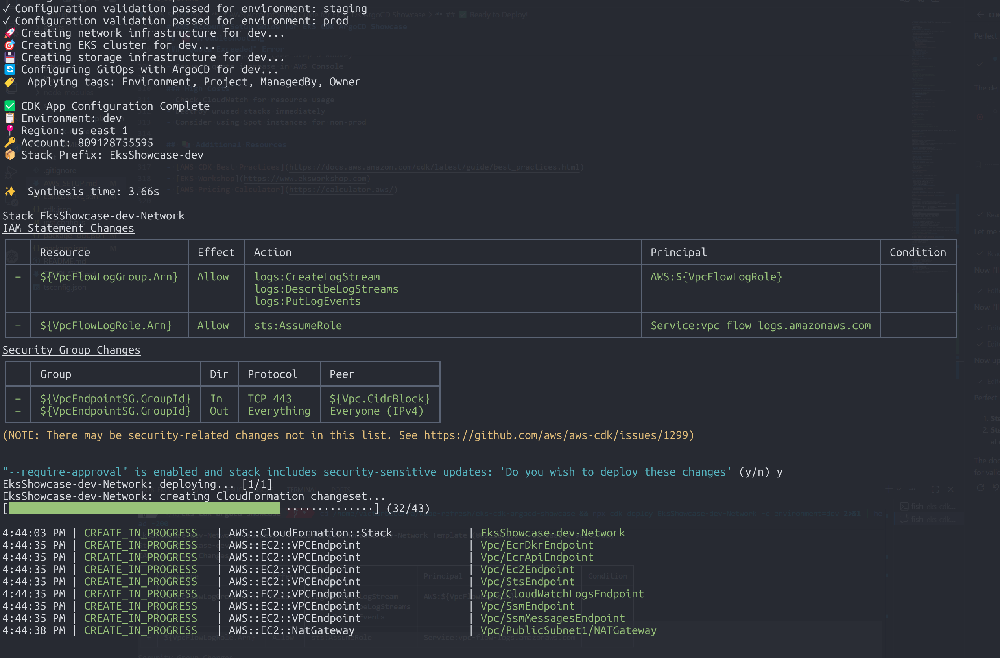

# AWS Account Setup Guide for EKS CDK ArgoCD Showcase

This guide walks you through setting up a new AWS account for deploying the EKS CDK showcase project.

## 📋 Prerequisites

- AWS Account created
- Local machine with:
  - Node.js 18+ installed
  - AWS CLI v2 installed

## 🔑 Step 1: Create IAM User for Development

It's best practice to use an IAM user rather than the root account for development.

### 1a. Login to AWS Console (Root Account)
1. Go to [AWS Console](https://console.aws.amazon.com)
2. Login with your root account credentials

### 1b. Create an IAM User
1. Navigate to **IAM** → **Users** → **Create user**
2. User name: `cdk-developer` (or your preferred name)
3. Click **Next**
4. Select **Attach policies directly**
5. Search for and attach these policies:
   - `AdministratorAccess` (for initial setup; you can restrict later)
   - Or for least-privilege, attach individual policies for:
     - `AmazonEC2FullAccess`
     - `AmazonEKSFullAccess`
     - `AmazonS3FullAccess`
     - `AWSCloudFormationFullAccess`
     - `IAMFullAccess`
     - `ElasticLoadBalancingFullAccess`
     - `AWSServiceRoleForAWSServiceRoleForElasticLoadBalancing`
6. Click **Create user**

### 1c. Create Access Keys
1. Select the user you just created
2. Go to **Security credentials** tab
3. Click **Create access key**
4. Select **Command Line Interface (CLI)**
5. Check **I understand...** checkbox
6. Click **Create access key**
7. **Copy and save the Access Key ID and Secret Access Key** (you won't see them again)

## 🖥️ Step 2: Configure AWS CLI

### 2a. Install AWS CLI (if not already installed)
```bash
# macOS
brew install awscli

# Linux
curl "https://awscli.amazonaws.com/awscli-exe-linux-x86_64.zip" -o "awscliv2.zip"
unzip awscliv2.zip
sudo ./aws/install

# Windows
# Download from: https://awscli.amazonaws.com/AWSCLIV2.msi
```

### 2b. Configure AWS Credentials
```bash
# Interactive configuration
aws configure

# When prompted, enter:
# AWS Access Key ID: [paste your Access Key ID]
# AWS Secret Access Key: [paste your Secret Access Key]
# Default region name: us-east-1 (or your preferred region)
# Default output format: json
```

### 2c. Verify Configuration
```bash
# Test that credentials work
aws sts get-caller-identity

# Expected output:
# {
#     "UserId": "AIDAI...",
#     "Account": "123456789012",
#     "Arn": "arn:aws:iam::123456789012:user/cdk-developer"
# }
```

## 📍 Step 3: Set Environment Variables for CDK

The CDK project needs your AWS account information. Set these environment variables:

```bash
# Get your account ID from the output above
export CDK_DEFAULT_ACCOUNT=123456789012
export CDK_DEFAULT_REGION=us-east-1

# Optional: Default environment for deployment (dev/staging/prod)
export ENVIRONMENT=dev
```

**Make it permanent** (add to your shell profile):

```bash
# For bash users
echo 'export CDK_DEFAULT_ACCOUNT=123456789012' >> ~/.bashrc
echo 'export CDK_DEFAULT_REGION=us-east-1' >> ~/.bashrc
source ~/.bashrc

# For zsh users
echo 'export CDK_DEFAULT_ACCOUNT=123456789012' >> ~/.zshrc
echo 'export CDK_DEFAULT_REGION=us-east-1' >> ~/.zshrc
source ~/.zshrc

# For fish users
set -Ux CDK_DEFAULT_ACCOUNT 123456789012
set -Ux CDK_DEFAULT_REGION us-east-1
```

## 🧪 Step 4: Test the Setup

From the project root directory:

```bash
# 1. Verify AWS credentials
aws sts get-caller-identity

# 2. Install Node dependencies
npm install

# 3. Build the TypeScript code
npm run build

# 4. Synthesize CloudFormation for dev environment
npx cdk synth -c environment=dev

# Expected: Should complete without errors and display stack names
```

## � Step 5: CDK Bootstrap (Required Before First Deployment)

CDK Bootstrap creates the necessary AWS infrastructure (S3 buckets, IAM roles, CloudFormation stack) that CDK uses for deployments. This needs to be done **once per AWS account per region**.

```bash
# Bootstrap the default region
npx cdk bootstrap

# Or bootstrap a specific region
npx cdk bootstrap --region us-east-1
```

Expected output:
```
 ⏳  Bootstrapping environment aws://123456789012/us-east-1...
Trusted accounts for deployment: (none)
Trusted accounts for lookup: (none)
Using default execution policy of 'arn:aws:iam::aws:policy/AdministratorAccess'. Pass '--cloudformation-execution-policies' to customize.
CDKToolkit: creating CloudFormation changeset...
 ✅  Environment aws://123456789012/us-east-1 bootstrapped.
```

This creates:
- **S3 Bucket**: Stores CloudFormation templates and assets
- **IAM Roles**: Provides permissions for CDK deployments
- **CloudFormation Stack**: Named `CDKToolkit` - manages bootstrap resources

**Note**: You only need to bootstrap once per account/region combination. If you see the error `SSM parameter /cdk-bootstrap/hnb659fds/version not found`, it means bootstrap hasn't been run yet for that region.

## 💰 Step 6: (Optional) Set Up Cost Monitoring

To avoid unexpected charges, set up budget alerts:

1. Go to **AWS Console** → **Billing** → **Budgets**
2. Click **Create budget**
3. Select **Cost budget**
4. Set monthly limit (e.g., $100)
5. Add email notification when threshold is reached

## 📊 Step 7: Check Service Quotas

Ensure your account has sufficient quota for resources:

```bash
# Check VPC quota (usually 5 VPCs per region)
aws service-quotas get-service-quota \
  --service-code vpc \
  --quota-code L-F678F1CE \
  --region us-east-1

# Check EC2 quota
aws service-quotas get-service-quota \
  --service-code ec2 \
  --quota-code L-1216C47A \
  --region us-east-1
```

If you hit quotas, request an increase through the AWS Console.

## ⚠️ Cost Estimates

**Typical monthly costs** for dev/staging environments:

| Component | Dev (est.) | Staging (est.) | Prod (est.) |
|-----------|-----------|----------------|-----------|
| EKS Cluster | $73.00 | $73.00 | $73.00 |
| EC2 Nodes (t3.medium x 3) | $20.00 | $30.00 | $60.00 |
| NAT Gateway | $32.00 | $64.00 | $96.00 |
| Data Transfer | $5.00 | $5.00 | $10.00 |
| S3 Storage | $1.00 | $2.00 | $5.00 |
| **Total** | **~$131/mo** | **~$174/mo** | **~$244/mo** |

**To save costs in dev**:
- Use Spot instances (cheaper but interruptible)
- Delete the cluster when not testing (`cdk destroy`)
- Use smaller instance types

## ✅ Step 8: Deploy Network Stack

After bootstrapping, deploy the network infrastructure (VPC, subnets, NAT gateways):

```bash
# Deploy the Network stack
npx cdk deploy EksShowcase-dev-Network -c environment=dev --require-approval=never
```

### Deployment Process

The deployment will display IAM and security group changes for your approval, then proceed to create the CloudFormation stack:

```
✨  Synthesis time: 4.31s

EksShowcase-dev-Network: start: Building EksShowcase-dev-Network Template
EksShowcase-dev-Network: success: Built EksShowcase-dev-Network Template
EksShowcase-dev-Network: start: Publishing EksShowcase-dev-Network Template (809128755595-us-east-1-9ebf54d8)
EksShowcase-dev-Network: success: Published EksShowcase-dev-Network Template (809128755595-us-east-1-9ebf54d8)

IAM Statement Changes
┌───┬────────────────────────┬────────┬─────────────────────────┬─────────────────────────────────────┬───────────┐
│ + │ ${VpcFlowLogGroup.Arn} │ Allow  │ logs:CreateLogStream    │ AWS:${VpcFlowLogRole}               │           │
│   │                        │        │ logs:DescribeLogStreams │                                     │           │
│   │                        │        │ logs:PutLogEvents       │                                     │           │
├───┼────────────────────────┼────────┼─────────────────────────┼─────────────────────────────────────┼───────────┤
│ + │ ${VpcFlowLogRole.Arn}  │ Allow  │ sts:AssumeRole          │ Service:vpc-flow-logs.amazonaws.com │           │
└───┴────────────────────────┴────────┴─────────────────────────┴─────────────────────────────────────┴───────────┘

Security Group Changes
┌───┬──────────────────────────┬─────┬────────────┬──────────────────┐
│   │ Group                    │ Dir │ Protocol   │ Peer             │
├───┼──────────────────────────┼─────┼────────────┼──────────────────┤
│ + │ ${VpcEndpointSG.GroupId} │ In  │ TCP 443    │ ${Vpc.CidrBlock} │
│ + │ ${VpcEndpointSG.GroupId} │ Out │ Everything │ Everyone (IPv4)  │
└───┴──────────────────────────┴─────┴────────────┴──────────────────┘
```

### Sample Deployment in Action



The screenshot shows the actual deployment progress with:
- IAM and Security Group changes summary
- CREATE_IN_PROGRESS status for VPC endpoints, NAT Gateway, and other resources
- Real-time resource creation tracking

### Resources Created

This stack creates:
- **VPC** with CIDR block based on environment config
- **Public Subnets** in multiple AZs for NAT gateways and load balancers
- **Private Subnets** in multiple AZs for EKS nodes
- **NAT Gateways** for outbound internet access from private subnets
- **VPC Flow Logs** for network monitoring
- **VPC Endpoints** for AWS service access without internet transit

**Next Steps**: After the Network stack is deployed, you can proceed to deploy the remaining stacks (EKS, Storage, GitOps).

## ✅ Ready to Deploy!

Once you've completed the above steps (including CDK Bootstrap and Network Stack), you're ready to deploy the remaining infrastructure:

```bash
# Deploy all remaining stacks to dev environment
npx cdk deploy --all -c environment=dev --require-approval=never

# Or deploy individual stacks in order:
npx cdk deploy EksShowcase-dev-EKS -c environment=dev --require-approval=never
npx cdk deploy EksShowcase-dev-Storage -c environment=dev --require-approval=never
npx cdk deploy EksShowcase-dev-GitOps -c environment=dev --require-approval=never
```

**Stack deployment order**:
1. ✅ Network (already deployed in Step 8)
2. EKS Cluster (depends on Network)
3. Storage (S3 buckets - independent)
4. GitOps (ArgoCD - depends on EKS)

## 🧹 Cleanup

When done testing, **destroy the infrastructure** to stop charges:

```bash
# Dev/Staging
npx cdk destroy --all

# Production (requires manual termination protection removal first)
ENVIRONMENT=prod npx cdk destroy --all
```

## 🆘 Troubleshooting

### "AccessDenied" Error
- Verify IAM user has the correct permissions
- Check that access keys are correct
- Ensure `CDK_DEFAULT_ACCOUNT` environment variable is set

### "ValidationError: Template format error"
- Run `npm run build` to check for TypeScript errors
- Run `npx cdk synth` to validate CloudFormation

### "Quota Exceeded" Error
- Check service quotas (see Step 6 above)
- Request quota increase in AWS Console

### High Costs
- Check CloudWatch for resource usage
- Destroy unused stacks immediately
- Consider using Spot instances for non-prod

## 📚 Additional Resources

- [AWS CDK Best Practices](https://docs.aws.amazon.com/cdk/latest/guide/best_practices.html)
- [EKS Workshop](https://www.eksworkshop.com)
- [AWS Pricing Calculator](https://calculator.aws/)
